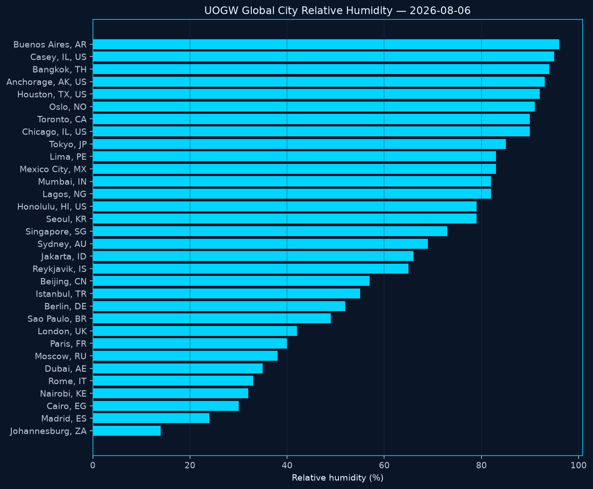

# Unified Open Global Weather (UOGW)

**An open atmospheric data commons for research — curated by [Midwest Stratospheric Data Systems](https://www.midwestsds.com)**

**Start here:** [`science-package.json`](./data/latest/science-package.json) · [`science-analytics.json`](./data/latest/science-analytics.json) · [`hub-endpoints.json`](./data/latest/hub-endpoints.json)  
**Data Hub:** https://midwestsds.com/msds-data-hub.html

---

## Built-in graphs and charts (°F)

### Global city temperatures

Horizontal bar chart of current surface air temperature for each successful global city sample. Bars are sorted cold→hot; warmer colors mark heat (≥86°F / ≥95°F).

### City temperature map

Scatter map of the same city samples by longitude/latitude, colored by temperature (°F). Shows geographic pattern of the daily open sample set.

### Casey, IL hourly temperature

24-hour temperature trace for Casey, Illinois (MSDS home site). Useful for diurnal range and local extremes that feed anomaly rules.

### NDBC marine samples

NOAA NDBC buoy sample panel: wave height (meters) plus water and air temperature (°F) for stations included in today's marine pull.

### Global city relative humidity

Relative humidity (%) for the same global city sample network. Dry+hot combinations can contribute to compound research flags.

### Anomaly severity

Count of UOGW research anomaly flags by severity (alert / watch / info). **Not** an NWS warning product.

#### Anomaly detection guide

| Severity | Meaning |
|----------|---------|
| **Alert** | Strong outlier vs thresholds or baseline (extreme heat/cold, \|z\| ≥ 3, very high waves). |
| **Watch** | Elevated interest — heat/cold, wind, low pressure, or \|z\| ≥ 2.5 vs the 7-day baseline. |
| **Info** | Lower urgency (hot + very dry, strong high, warm water sample). |

Methods: [`docs/ANOMALY_METHODS.md`](./docs/ANOMALY_METHODS.md) · [`visuals/ANOMALY_GUIDE.md`](./visuals/ANOMALY_GUIDE.md) · [`anomaly-report.json`](./data/latest/anomaly-report.json)

### Research cities daily Tmin / Tmax

Daily minimum and maximum temperatures for the research climate city set. Compares day-range width across selected locations.

### Daily summary card

One-page snapshot of today's visual package: city count, temperature span, Casey hours, NDBC samples, and anomaly total.

Full descriptions: [`visuals/CHART_DESCRIPTIONS.md`](./visuals/CHART_DESCRIPTIONS.md) · gallery: [`visuals/latest/CHARTS.md`](./visuals/latest/CHARTS.md)

---

## Feature highlights

| Area | What you get |
|------|----------------|
| Daily science package | Combined observations + summary |
| Science analytics | Extremes, coverage, heat-index flags |
| Anomaly detection | Threshold + multi-method z-scores (research only) |
| Charts automation | °F PNGs + markdown after data workflows |
| Hub endpoints map | `data/latest/hub-endpoints.json` |
| Health / rollback | Self-heal, alert PRs, rollback docs |

See [`docs/FEATURES.md`](./docs/FEATURES.md).

---

## Citation

> Midwest Stratospheric Data Systems (2026). Unified Open Global Weather (UOGW). https://github.com/Midwest-Stratospheric/Unified-Open-Global-Weather

Always cite upstream providers (Open-Meteo, NOAA NDBC, NOAA NCEI, NASA, etc.).

---

**Midwest Stratospheric Data Systems** · Casey, Illinois · launchcontrol@midwestsds.com · NASA GLOBE **GO-4VW9B** · Ham **KE9CFY**
