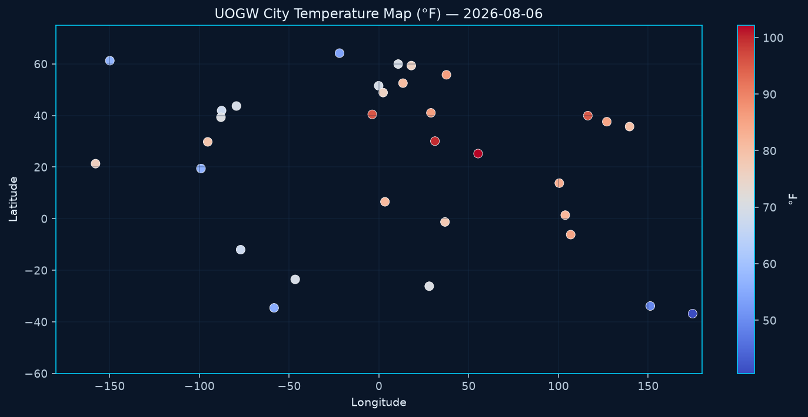
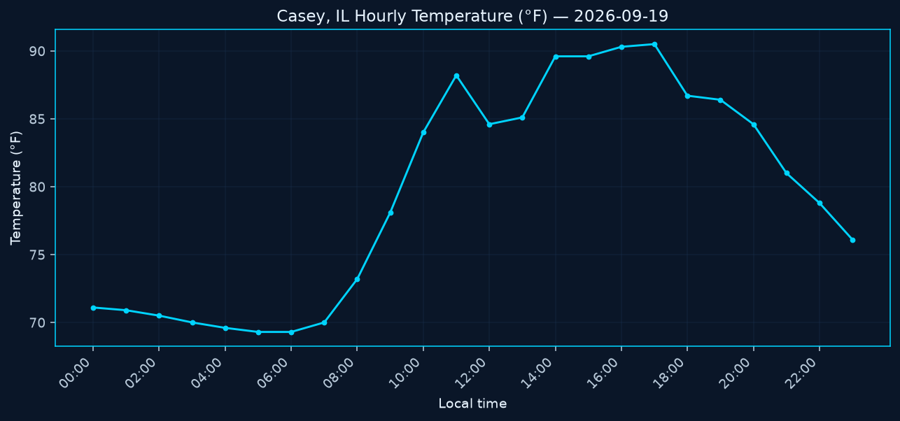
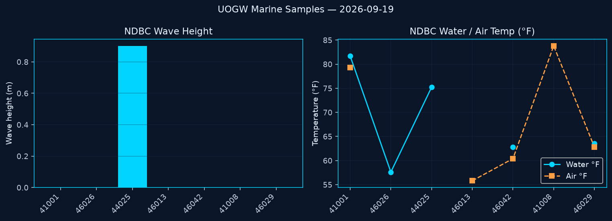
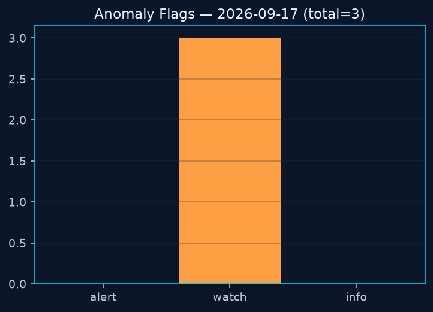
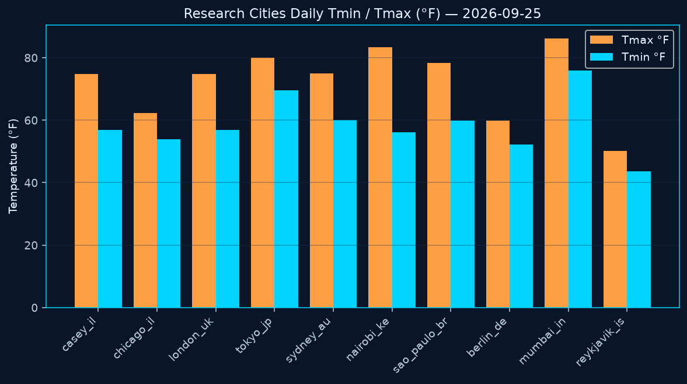
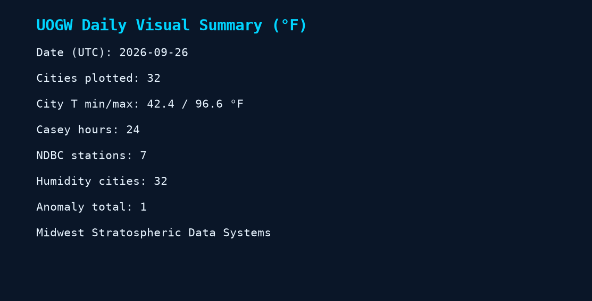

# Unified Open Global Weather (UOGW)

**An open atmospheric data commons for research — curated by [Midwest Stratospheric Data Systems](https://www.midwestsds.com)**

[](https://creativecommons.org/licenses/by/4.0/)
[](https://www.midwestsds.com/portal.html)
[](./catalog/catalog.json)
[](./data/entries/)
[](./data/latest/anomaly-report.json)
[](./data/latest/satellite-radiance-index.json)
[](./visuals/latest/)
[](./docs/Home.md)

> **Mission:** Deliver a practical, versioned, multi-layer open atmospheric package every day — surface, marine, upper-air indexes, anomaly screens, satellite radiance discovery, and MSDS near-space flight data — so researchers, educators, and builders can work from one coherent commons.

**Start here for analysis:** [`data/latest/science-package.json`](./data/latest/science-package.json) · [`data/latest/research-summary.json`](./data/latest/research-summary.json)

**Graphs:** embedded below in this README · [`visuals/latest/CHARTS.md`](./visuals/latest/CHARTS.md)

---

## Built-in graphs and charts

All graphs below render **in this README** when you open the repo on GitHub. Generated daily from `data/latest/` (no external page).

### Global city temperatures


### City temperature map



### Casey, IL hourly temperature



### NDBC marine samples



### Anomaly severity



### Research cities daily Tmin / Tmax



### Daily summary card



Full chart log + Mermaid: [`visuals/latest/CHARTS.md`](./visuals/latest/CHARTS.md) · Workflow: `charts-daily.yml` (11:00 UTC)

---

## Why this contributes to science

Most open weather repos stop at a static list of links. UOGW is different because it **commits real observation payloads every day**, rolls them into a **research summary**, screens **anomalies**, indexes **open satellite radiance paths**, and publishes **FAIR metadata** with a **data dictionary** — while remaining honest that agencies are still the system of record.

| Capability | What researchers get |
|------------|----------------------|
| Daily science package | Combined observations + summary in one JSON |
| Global city samples | 30+ international surface observations |
| Marine realtime | Parsed NDBC buoy observations |
| Upper-air discovery | IGRA station + Y2D indexes with stats |
| Anomaly detection | Threshold + z-score screens (research only) |
| Rolling baseline | 7-day observational context |
| Satellite radiance index | GOES/JPSS/COSMIC/MERRA-2 open path map |
| FAIR + citation bundle | Reusable daily metadata |
| Built-in charts | All graphs embedded in this README |
| First-party flight layer | MSDS X2Griffon near-space profiles as flown |

**We fly instruments.** HAB profiles enter the same commons as public indexes — not a private vault.

---

## Daily automation (UTC)

| Time | Workflow | Output |
|------|----------|--------|
| 01:15 | MSDS Ground Daily | Casey hourly observations |
| 05:00 | Global Samples Daily | Worldwide city observations |
| 05:30 | International Indexes | GHCN + foreign sources |
| 06:30 | IGRA Index Daily | Upper-air research entry |
| 07:45 | NDBC Marine Daily | Buoy realtime observations |
| 08:00 | Catalog Rebuild | Status rollup |
| 09:00 | Daily Research Package | Science package + summary + climate |
| 09:15 | Rolling Baseline | 7-day baseline |
| 09:30 | Anomaly Detection | Anomaly report |
| 09:45 | FAIR Metadata | FAIR + citation bundle |
| 10:00 | Satellite Radiance | Open radiance product index |
| 11:00 | Charts Daily | PNG + markdown/Mermaid charts |

All jobs also support **Actions → Run workflow**.

Independence: automations run on GitHub Actions inside this repository. They do **not** require midwestsds.com to be online.

---

## Where the data lives

```
data/
  entries/YYYY-MM-DD/     # Daily research folder
  latest/                 # Stable paths for notebooks
visuals/
  latest/*.png            # Chart images (also shown in README)
  latest/CHARTS.md        # Chart log + Mermaid
layers/
docs/
catalog/catalog.json
sources/registry.json
```

Base: `https://raw.githubusercontent.com/Midwest-Stratospheric/Unified-Open-Global-Weather/main/`

---

## Documentation

| Doc | Link |
|-----|------|
| Charts log | [`visuals/latest/CHARTS.md`](./visuals/latest/CHARTS.md) |
| Visuals guide | [`docs/VISUALS.md`](./docs/VISUALS.md) |
| Anomaly methods | [`docs/ANOMALY_METHODS.md`](./docs/ANOMALY_METHODS.md) |
| Data dictionary | [`docs/DATA_DICTIONARY.md`](./docs/DATA_DICTIONARY.md) |
| Project wiki | [`docs/Home.md`](./docs/Home.md) |
| Health / alert PRs | [`docs/OPS_HEALTH.md`](./docs/OPS_HEALTH.md) |
| Rollback | [`docs/ROLLBACK.md`](./docs/ROLLBACK.md) |

---

## Citation

> Midwest Stratospheric Data Systems (2026). Unified Open Global Weather (UOGW). https://github.com/Midwest-Stratospheric/Unified-Open-Global-Weather

Always also cite upstream providers (Open-Meteo, NOAA NDBC, NOAA NCEI, NASA, etc.).

---

## Contact

**Midwest Stratospheric Data Systems**  
Casey, Illinois, USA  
launchcontrol@midwestsds.com  
https://www.midwestsds.com  

NASA GLOBE: **GO-4VW9B** · Ham: **KE9CFY**

---

*Open atmosphere. Daily packages. Graphs in the README. Midwest-made flight data for everyone.*
