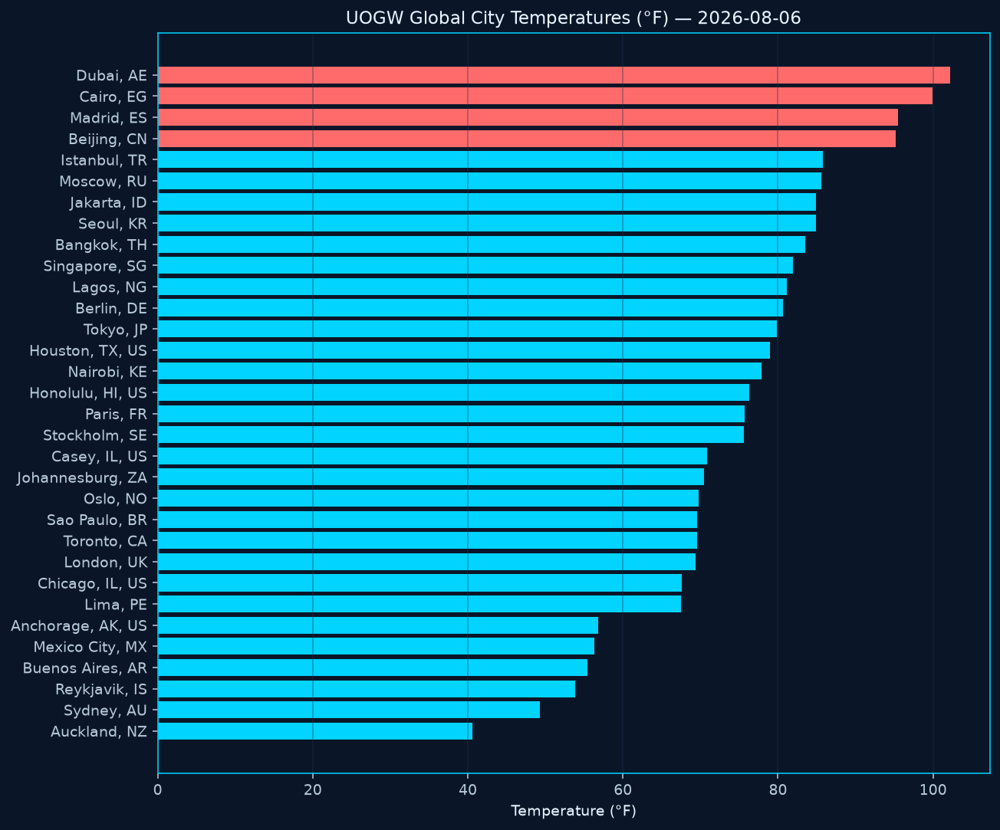
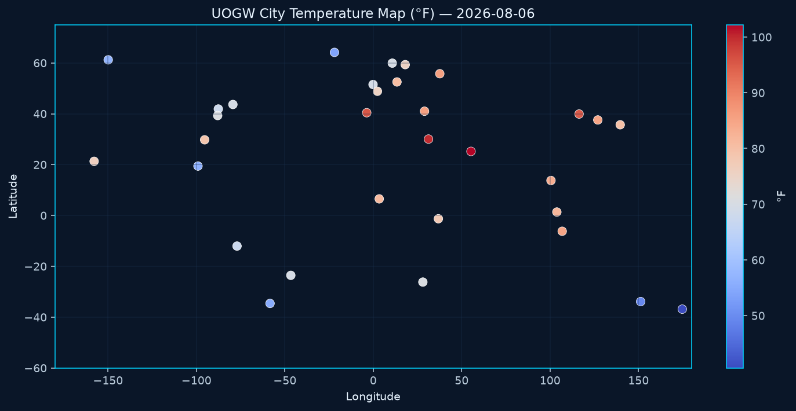
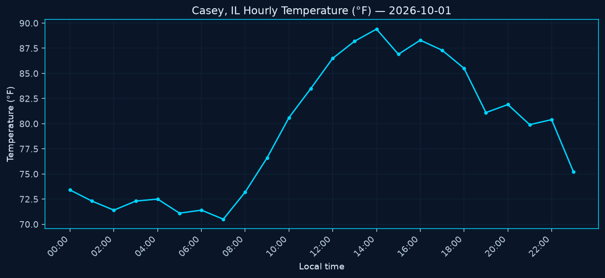
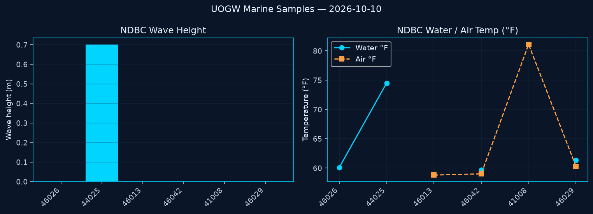
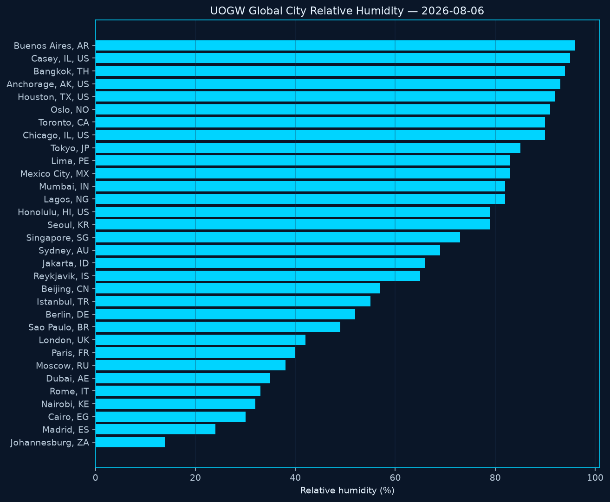
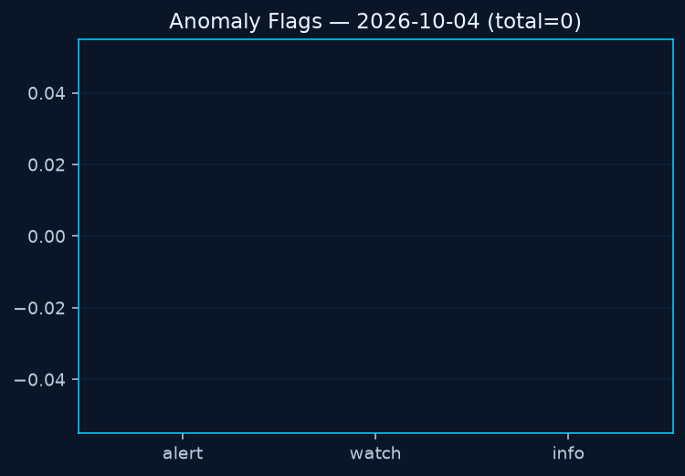
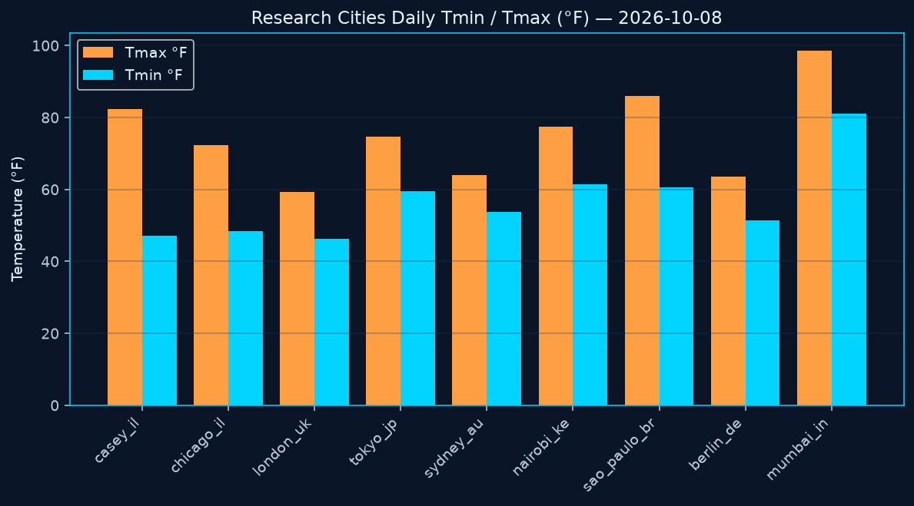
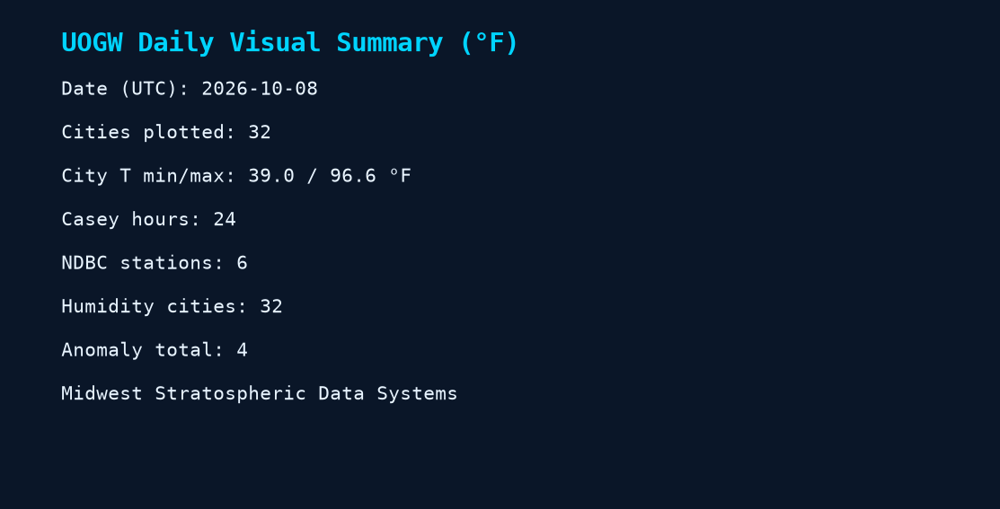

  

# Unified Open Global Weather (UOGW)

**An open atmospheric data commons for research — curated by [Aerostratospheric](https://www.midwestsds.com)**

**Start here:** [`science-package.json`](./data/latest/science-package.json) · [`science-analytics.json`](./data/latest/science-analytics.json) · [`hub-endpoints.json`](./data/latest/hub-endpoints.json) · [`docs/DATA_PACKAGES.md`](./docs/DATA_PACKAGES.md)  
**Data Hub:** https://midwestsds.com/msds-data-hub.html  
**Sibling GIR (hazards / open geospatial):** [aerostratospheric-defense-gir](https://github.com/Midwest-Stratospheric/aerostratospheric-defense-gir)

---

## What UOGW is

A **versioned, multi-layer discovery and sampling layer** for open atmospheric observations: ground, marine, upper-air, stratospheric/space, satellite/model, and first-party Aerostratospheric near-space flight products. Independent GitHub Actions keep indexes, science packages, anomaly reports, and °F charts fresh. UOGW does **not** replace agency systems of record; it organizes public access with attribution.

---

## Daily data packages

| Package | Path | Purpose |
|---------|------|---------|
| Science package | `data/latest/science-package.json` | Combined observations + summary |
| Science analytics | `data/latest/science-analytics.json` | Extremes, coverage, research flags |
| Anomaly report | `data/latest/anomaly-report.json` | Multi-method research screening |
| Hub endpoints | `data/latest/hub-endpoints.json` | Stable machine map for the Data Hub |
| Layer trees | `layers/` | Ground · Marine · Upper-air · … |
| Weekly status | `reports/weekly/` | Automated weekly roll-up |
| Charts | `visuals/latest/` | °F PNG gallery + markdown |

Full consumer guide: **[docs/DATA_PACKAGES.md](./docs/DATA_PACKAGES.md)**

---

## Built-in graphs and charts (°F)

### Global city temperatures

Horizontal bar chart of current surface air temperature for each successful global city sample. Bars are sorted cold→hot; warmer colors mark heat (≥86°F / ≥95°F).

### City temperature map

Scatter map of the same city samples by longitude/latitude, colored by temperature (°F).

### Casey, IL hourly temperature

24-hour Open-Meteo model temperature trace for the Casey, Illinois grid point. Model data, not station observations. Weather data by Open-Meteo.com, CC BY 4.0.

### NDBC marine samples

NOAA NDBC buoy sample panel: wave height (meters) plus water and air temperature (°F).

### Global city relative humidity

Relative humidity (%) for the same global city sample network.

### Anomaly severity

Count of UOGW research anomaly flags by severity (alert / watch / info). **Not** an NWS warning product.

#### Anomaly detection guide

| Severity | Meaning |
|----------|---------|
| **Alert** | Strong outlier vs thresholds or baseline (extreme heat/cold, \|z\| ≥ 3, very high waves). |
| **Watch** | Elevated interest — heat/cold, wind, low pressure, or \|z\| ≥ 2.5 vs the 7-day baseline. |
| **Info** | Lower urgency (hot + very dry, strong high, warm water sample). |

Methods: [`docs/ANOMALY_METHODS.md`](./docs/ANOMALY_METHODS.md) · [`visuals/ANOMALY_GUIDE.md`](./visuals/ANOMALY_GUIDE.md) · [`anomaly-report.json`](./data/latest/anomaly-report.json)

### Research cities daily Tmin / Tmax

### Daily summary card

Full descriptions: [`visuals/CHART_DESCRIPTIONS.md`](./visuals/CHART_DESCRIPTIONS.md) · gallery: [`visuals/latest/CHARTS.md`](./visuals/latest/CHARTS.md)

---

## Feature highlights

| Area | What you get |
|------|----------------|
| Daily science package | Combined observations + summary |
| Science analytics | Extremes, coverage, heat-index flags |
| Anomaly detection | Threshold + multi-method z-scores (research only) |
| Charts automation | °F PNGs + markdown after data workflows |
| Hub endpoints map | `data/latest/hub-endpoints.json` |
| Health / rollback | Self-heal, alert PRs, rollback docs |
| Weekly status report | `reports/weekly/` via Actions |
| Six atmospheric layers | Ground → Flight (see `docs/Layers.md`) |
| 25+ cataloged datasets | `catalog/catalog.json` |

See [`docs/FEATURES.md`](./docs/FEATURES.md).

---

## Related open ecosystem

| Repository | Role |
|------------|------|
| [aerostratospheric-defense-gir](https://github.com/Midwest-Stratospheric/aerostratospheric-defense-gir) | Open-tier geospatial hazard / defense-adjacent GIR + daily exec reports |
| [msds-data](https://github.com/Midwest-Stratospheric/msds-data) | Casey Open-Meteo model weather series (Weather data by Open-Meteo.com, CC BY 4.0) + HAB flight packages |
| [International-Ground-Data-Repository](https://github.com/Midwest-Stratospheric/International-Ground-Data-Repository) | IGRA / international ground indexes |
| [x2griffon](https://github.com/Midwest-Stratospheric/x2griffon) | Payload platform |

---

## Repository hygiene

| Doc | Purpose |
|-----|---------|
| [CONTRIBUTING.md](./CONTRIBUTING.md) | How to contribute (open/redistributable only) |
| [SECURITY.md](./SECURITY.md) | Vulnerability reporting |
| [docs/DATA_PACKAGES.md](./docs/DATA_PACKAGES.md) | Package map for consumers |
| [docs/FEATURES.md](./docs/FEATURES.md) | Feature catalog |
| [docs/Layers.md](./docs/Layers.md) | Layer definitions |

---

## License

UOGW contains both Aerostratospheric data and third-party data, so licensing is per source. Full list with terms links: [`layers/ATTRIBUTION.md`](./layers/ATTRIBUTION.md). This applies to `layers/`, `data/` and `snapshots/` here and on the Hugging Face mirror.

- **Aerostratospheric first-party data and documentation:** CC BY 4.0 ([`layers/LICENSE`](./layers/LICENSE)). This covers the GMC-800 radiation station, the X-Sense logger, flight products and docs.
- **Third-party layers keep their own terms:**
  - NOAA / NWS U.S. government data (NWS, NCEI GHCN-Daily and IGRA, NDBC, SWPC, NCEP GFS) is public domain: https://www.weather.gov/disclaimer
  - Open-Meteo data is CC BY 4.0 (https://open-meteo.com/en/license). This includes the Casey, Illinois daily/hourly series, which is **Open-Meteo model data, not observations from our station**. "Weather data by Open-Meteo.com, CC BY 4.0."
  - Copernicus CAMS air-quality data (via Open-Meteo) is under the Copernicus licence: https://apps.ecmwf.int/datasets/licences/copernicus/
  - Iowa Environmental Mesonet data is used per its terms: https://mesonet.agron.iastate.edu/disclaimer.php
  - NOAA/NASA satellite catalog metadata follows the provider's data policies.
- **Excluded:** KILCASEY47 data retrieved through the Weather Underground API (`layers/ground/casey/wunderground/`, `casey-wu.json`) is not licensed by us while the WU API terms are reviewed.
- **Code** (scripts, workflows) is not licensed under CC BY 4.0.

---

## Citation

> Aerostratospheric (2026). Unified Open Global Weather (UOGW). https://github.com/Midwest-Stratospheric/Unified-Open-Global-Weather

Always cite upstream providers (Open-Meteo, NOAA NDBC, NOAA NCEI, NASA, etc.); see [`layers/ATTRIBUTION.md`](./layers/ATTRIBUTION.md).

---

Published by Aerostratospheric, Olney, Illinois. · launchcontrol@midwestsds.com · NASA GLOBE **GO-4VW9B** · Ham **KE9CFY**

  

