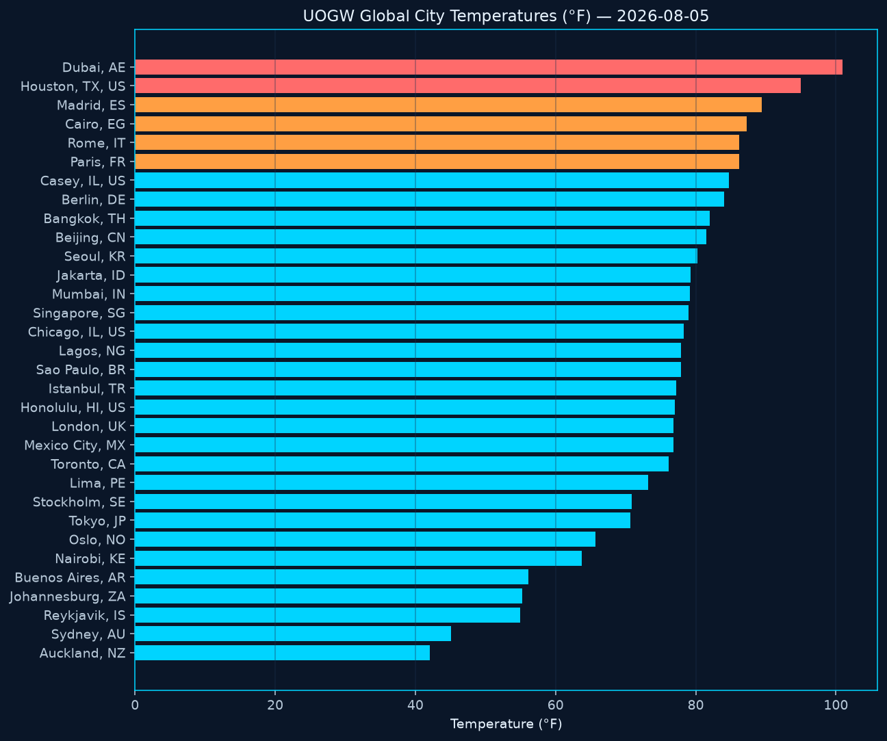
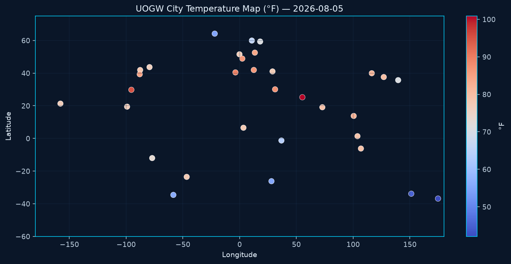
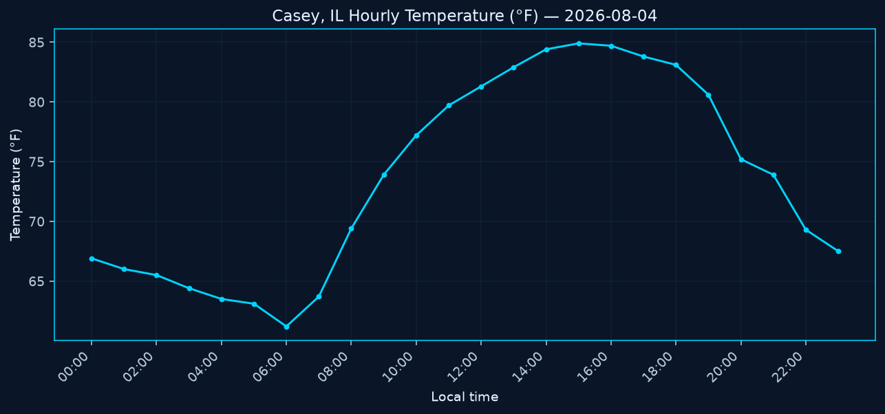
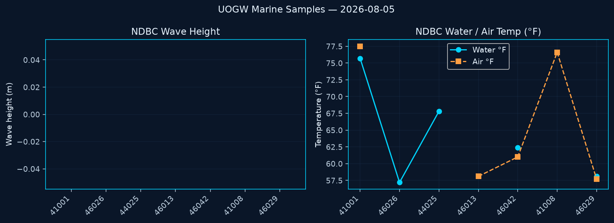
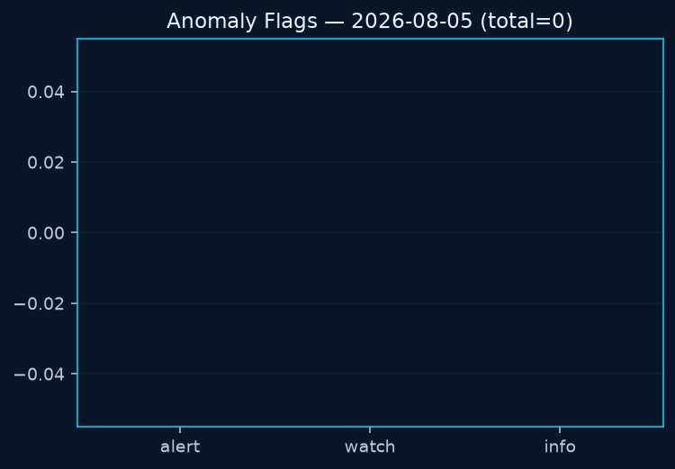
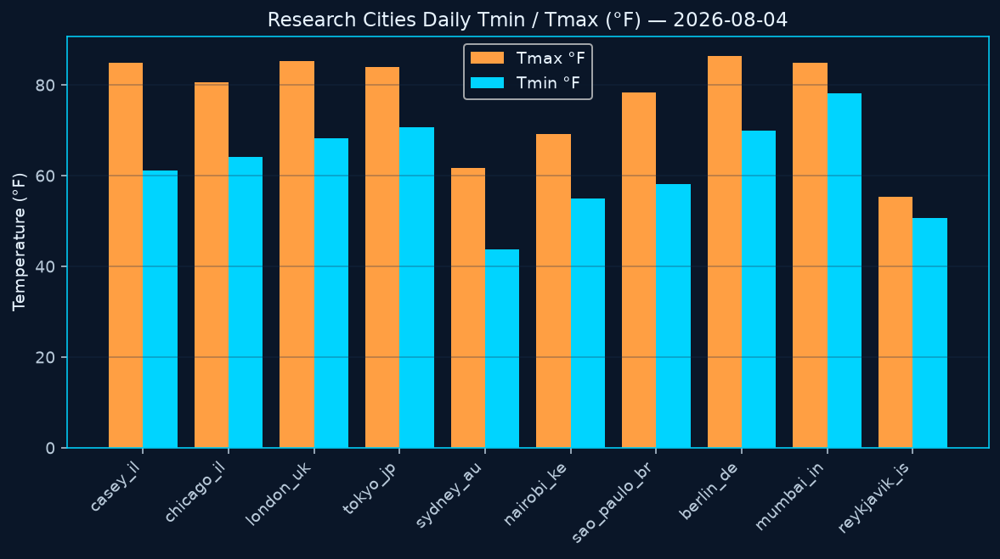
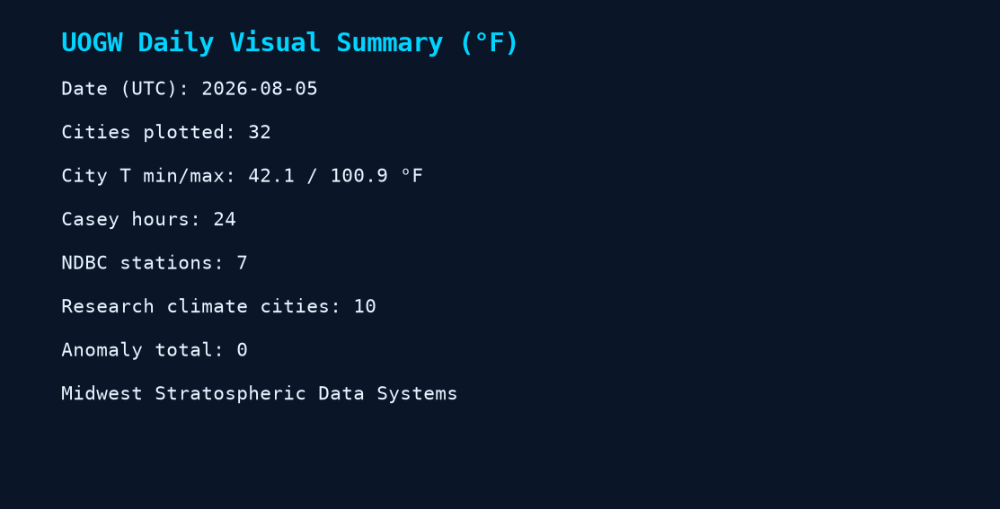
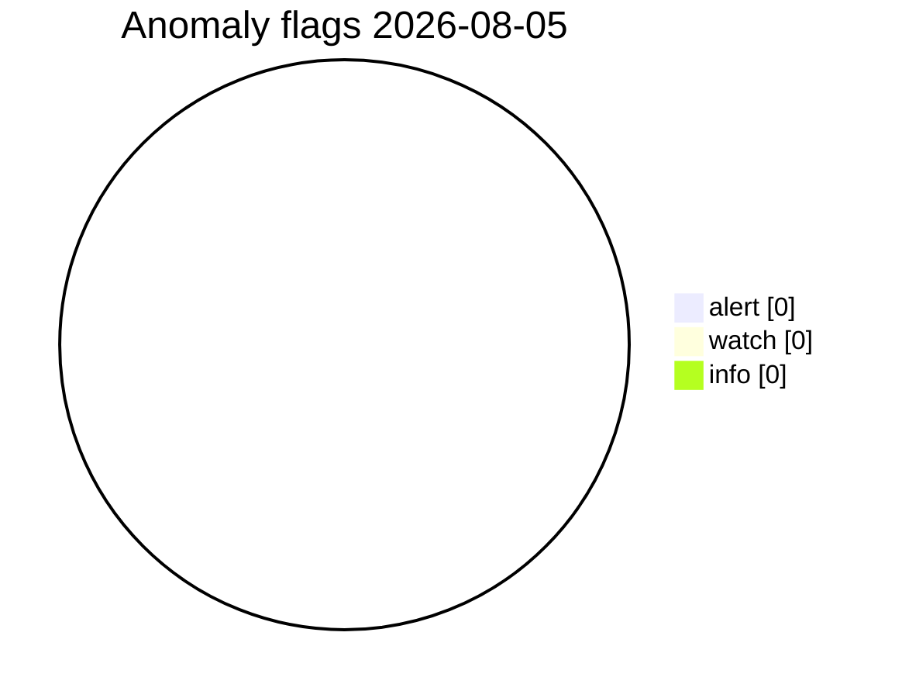
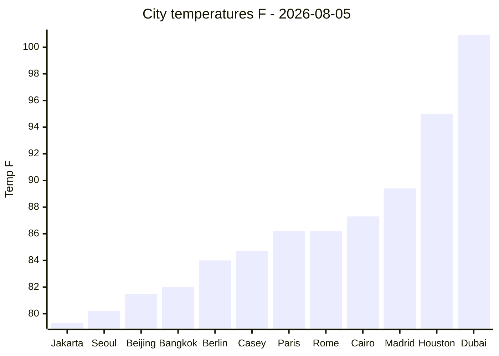

# UOGW Charts — 2026-08-05

Temperatures shown in **Fahrenheit (°F)**. Generated automatically from repository data.

_Generated at 2026-08-05T06:05:55Z UTC · Midwest Stratospheric Data Systems_

## PNG charts

### Global city temperatures (°F)

### City temperature map (°F)

### Casey hourly temperature (°F)

### NDBC marine samples

### Anomaly severity

### Research cities Tmin/Tmax (°F)

### Daily summary card

## Anomaly severity (Mermaid)

## City temperatures °F (Mermaid xychart)

## Snapshot table (°F)

| Metric | Value |
|--------|-------|
| Date UTC | 2026-08-05 |
| Cities OK | 32 |
| City T min/max °F | 42.1 / 100.9 |
| Anomaly total | 0 |
| Casey hours | 24 |
| NDBC samples | 7 |
| Research climate cities | 10 |

Source observation files remain in metric units for science interoperability; charts are °F for display.

