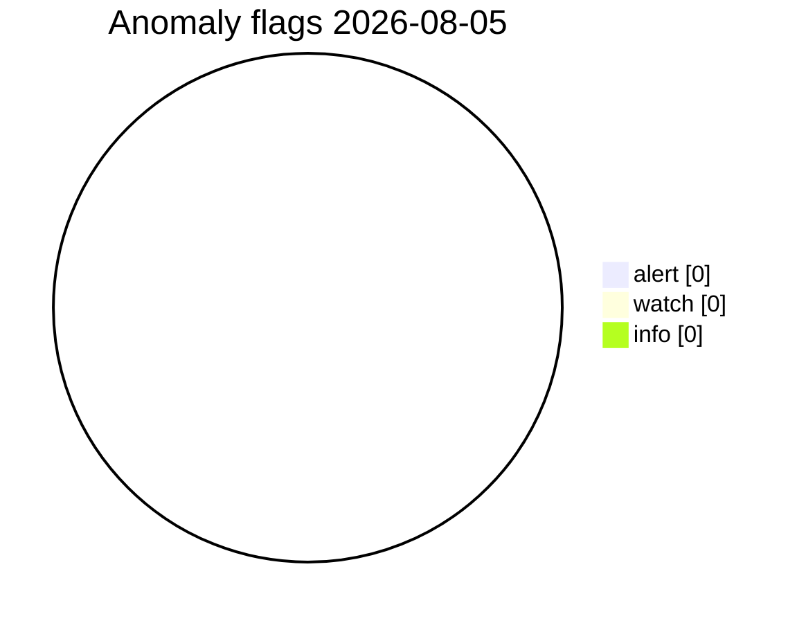
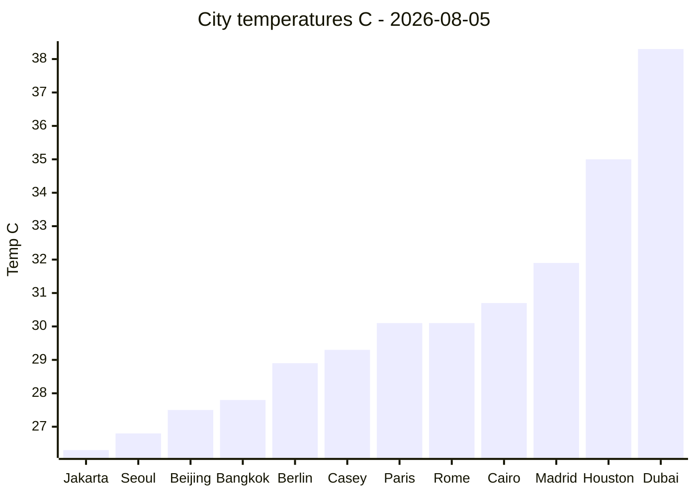
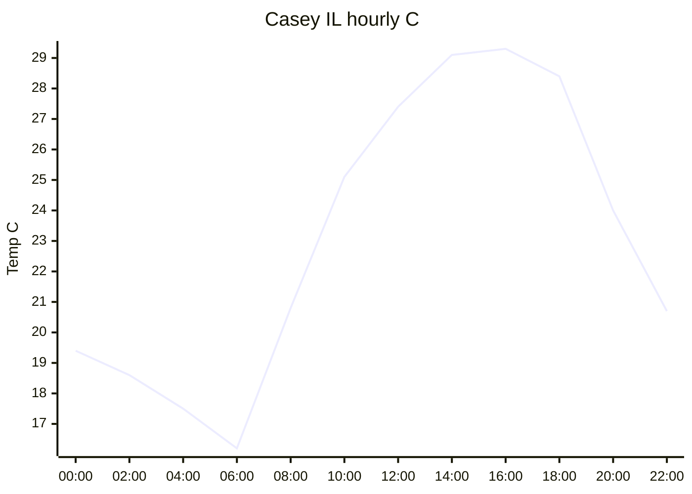

# UOGW Charts - 2026-08-05

Generated from data in this repository. View on GitHub — no external webpage.

_Generated at 2026-08-05T05:38:44Z UTC · Midwest Stratospheric Data Systems_

## PNG charts

### Global city temperatures

### City temperature map

### Casey hourly temperature

### NDBC marine samples

### Anomaly severity

### Research cities Tmin/Tmax

## Anomaly severity (Mermaid)

## City temperatures (Mermaid xychart)

## Casey hourly (Mermaid xychart)

## Snapshot table

| Metric | Value |
|--------|-------|
| Date UTC | 2026-08-05 |
| Cities OK | 32 |
| City T min/max C | 5.6 / 38.3 |
| Anomaly total | 0 |
| Casey hours | 24 |
| NDBC samples | 7 |

Data sources: `data/latest/*.json` in this repo.

