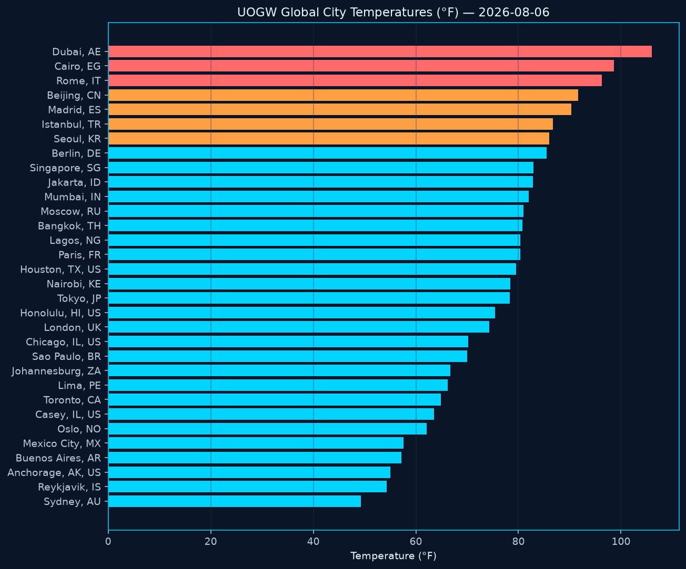
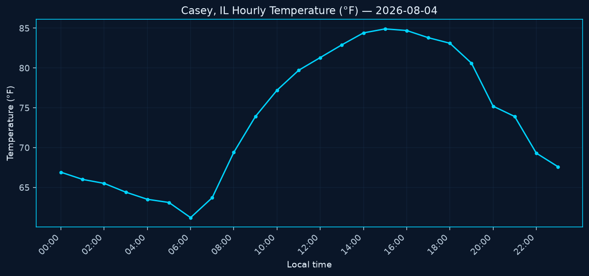
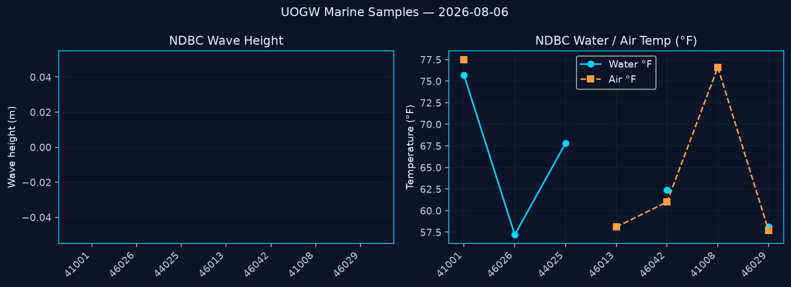
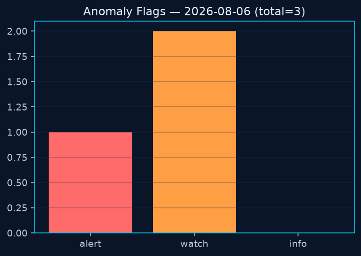
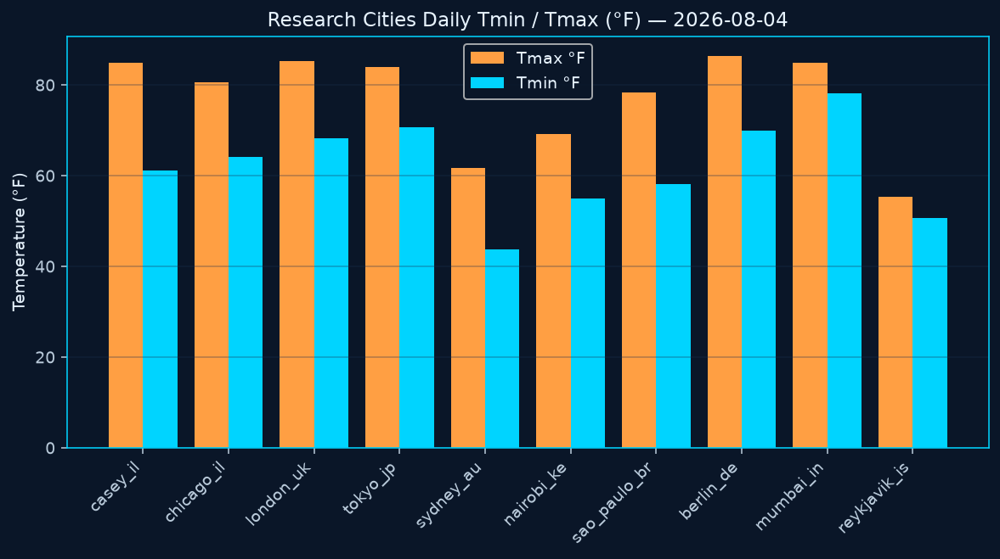
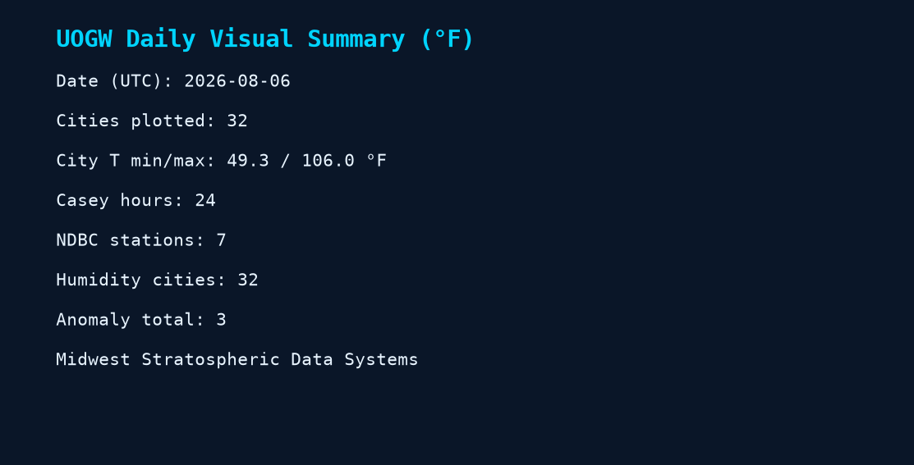
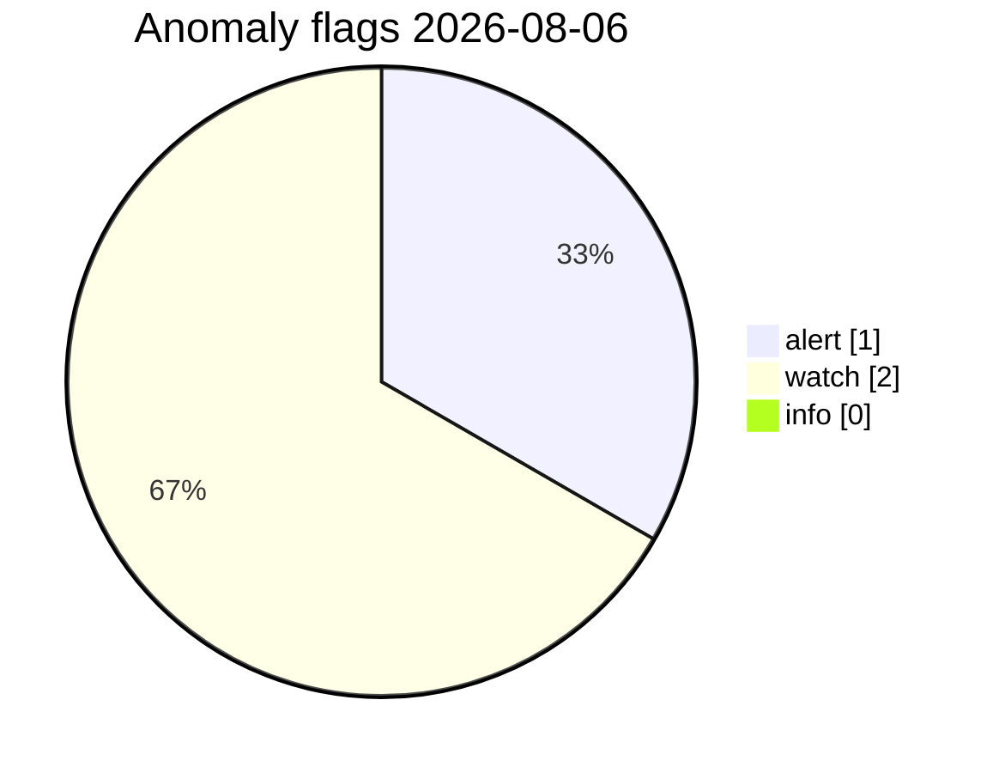

# UOGW Charts — 2026-08-06

Temperatures shown in **Fahrenheit (°F)**. Generated automatically from repository data.

_Generated at 2026-08-06T02:57:24Z UTC · Midwest Stratospheric Data Systems_

## PNG charts

### Global city temperatures (°F)

### City temperature map (°F)

### Casey hourly temperature (°F)

### NDBC marine samples

### Global city relative humidity (%)

### Anomaly severity

#### Anomaly detection guide (what this graph means)

UOGW counts **research flags** for the daily sample set — **not** National Weather Service warnings.

| Severity | Meaning |
|----------|---------|
| **Alert** | Strong outlier vs thresholds or baseline (extreme heat/cold, |z| >= 3, very high waves). |
| **Watch** | Elevated interest — heat/cold, wind, low pressure, or |z| >= 2.5 vs the 7-day baseline. |
| **Info** | Lower urgency (hot + very dry, strong high, warm water sample). |

**How flags are made:** (1) absolute thresholds in `analytics/anomaly-thresholds.json`, (2) z-scores vs rolling baseline (population z primary; MAD z also reported), (3) site rules such as large Casey diurnal range.

Today: **alert 1** · **watch 2** · **info 0** · total **3**

Full methods: [docs/ANOMALY_METHODS.md](../../docs/ANOMALY_METHODS.md) · short guide: [ANOMALY_GUIDE.md](../ANOMALY_GUIDE.md) · data: [anomaly-report.json](../../data/latest/anomaly-report.json)

### Research cities Tmin/Tmax (°F)

### Daily summary card

## Anomaly severity (Mermaid)

## Snapshot table (°F)

| Metric | Value |
|--------|-------|
| Date UTC | 2026-08-06 |
| Cities OK | 32 |
| City T min/max °F | 49.3 / 106.0 |
| Anomaly total | 3 |
| Casey hours | 24 |
| NDBC samples | 7 |

Source observation files remain metric; charts are °F for display.

