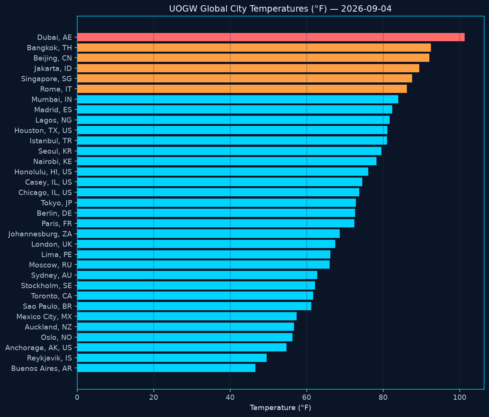
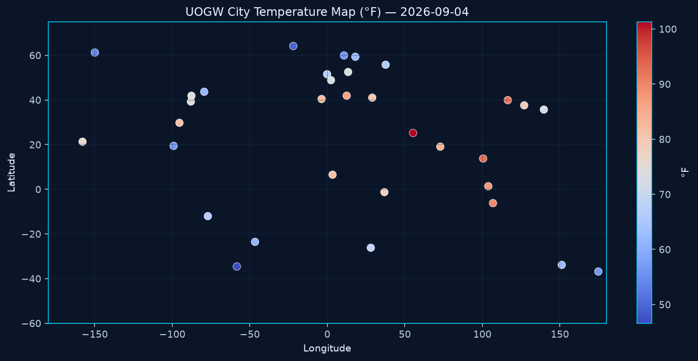
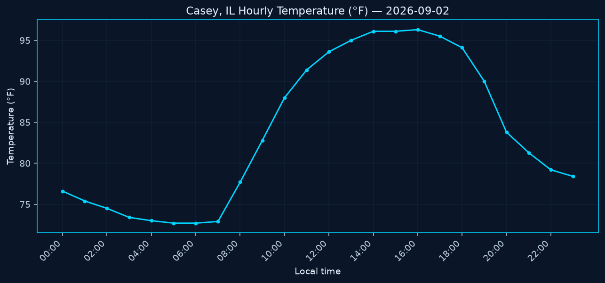
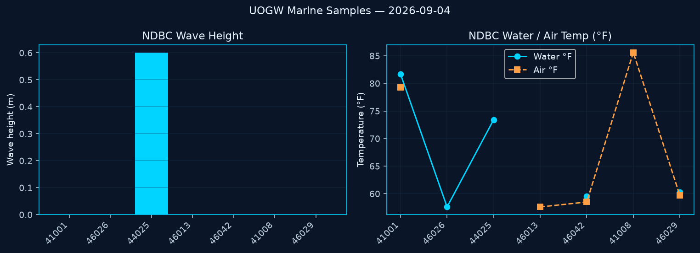
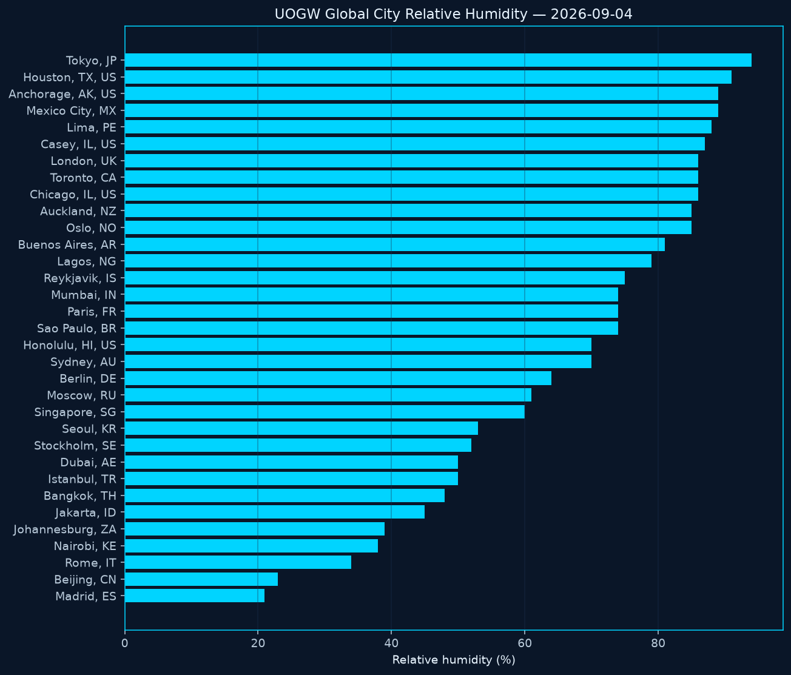
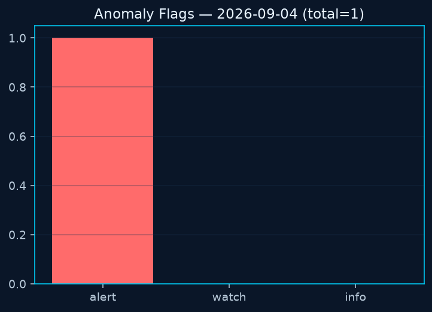
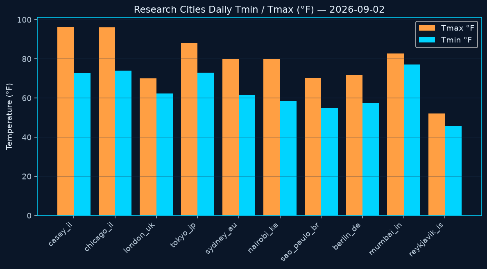
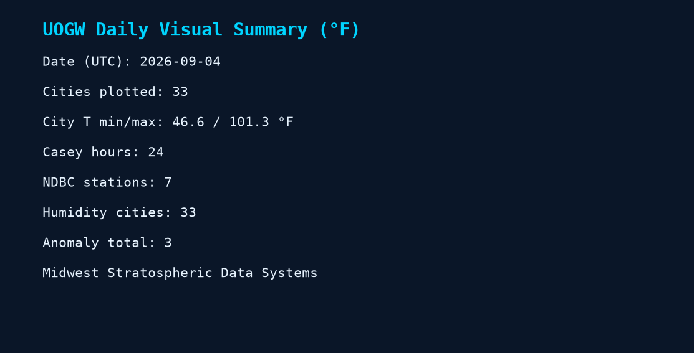
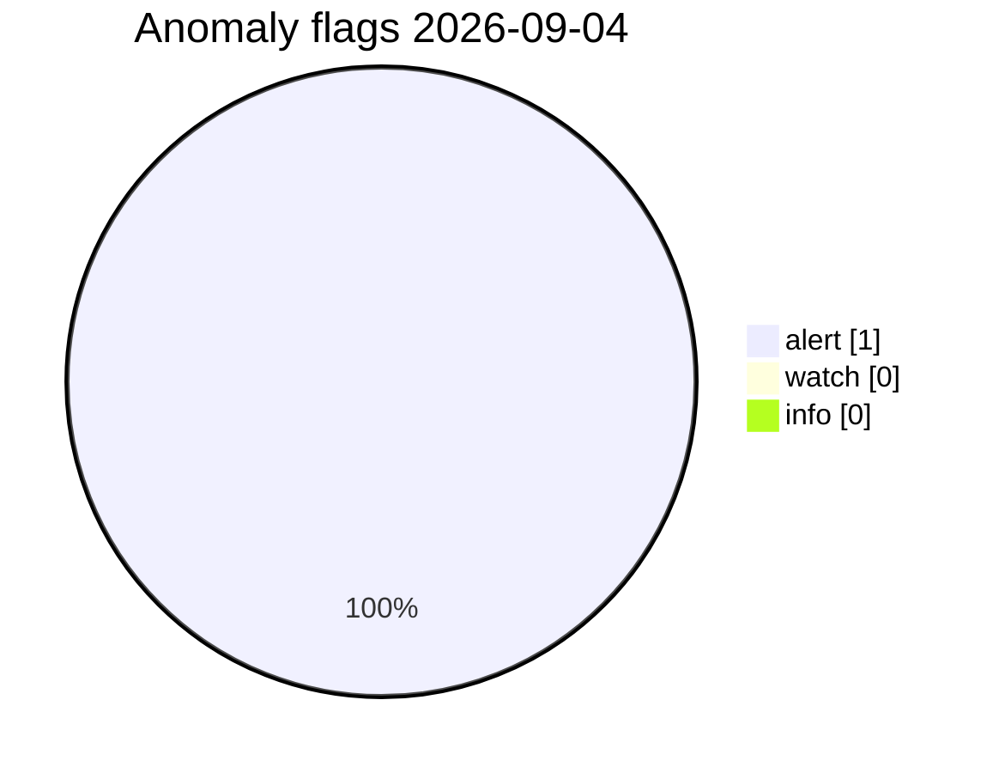

# UOGW Charts — 2026-09-04

Temperatures shown in **Fahrenheit (°F)**. Generated automatically from repository data.

_Generated at 2026-09-04T12:17:02Z UTC · Midwest Stratospheric Data Systems_

## PNG charts

### Global city temperatures (°F)

*Horizontal bar chart of current surface air temperature for each successful global city sample. Bars sorted cold→hot; warmer colors mark heat (≥86°F / ≥95°F).*

### City temperature map (°F)

*Scatter map of city samples by longitude/latitude, colored by temperature (°F). Shows geographic pattern of the daily open sample set.*

### Casey hourly temperature (°F)

*24-hour temperature trace for Casey, Illinois (MSDS home site). Useful for diurnal range and local extremes that feed anomaly rules.*

### NDBC marine samples

*NOAA NDBC buoy sample panel: wave height (meters) plus water and air temperature (°F) for stations in today's marine pull.*

### Global city relative humidity (%)

*Relative humidity (%) for the global city sample network. Dry+hot combinations can contribute to compound research flags.*

### Anomaly severity

*Count of UOGW research anomaly flags by severity (alert / watch / info). Not an NWS warning product.*

#### Anomaly detection guide (what this graph means)

UOGW counts **research flags** for the daily sample set — **not** National Weather Service warnings.

| Severity | Meaning |
|----------|---------|
| **Alert** | Strong outlier vs thresholds or baseline (extreme heat/cold, |z| >= 3, very high waves). |
| **Watch** | Elevated interest — heat/cold, wind, low pressure, or |z| >= 2.5 vs the 7-day baseline. |
| **Info** | Lower urgency (hot + very dry, strong high, warm water sample). |

Today: **alert 1** · **watch 0** · **info 0** · total **1**

Full methods: [docs/ANOMALY_METHODS.md](../../docs/ANOMALY_METHODS.md) · [ANOMALY_GUIDE.md](../ANOMALY_GUIDE.md) · [CHART_DESCRIPTIONS.md](../CHART_DESCRIPTIONS.md)

### Research cities Tmin/Tmax (°F)

*Daily minimum and maximum temperatures for the research climate city set. Compares day-range width across selected locations.*

### Daily summary card

*One-page snapshot of today's visual package: city count, temperature span, Casey hours, NDBC samples, and anomaly total.*

## Anomaly severity (Mermaid)

## Snapshot table (°F)

| Metric | Value |
|--------|-------|
| Date UTC | 2026-09-04 |
| Cities OK | 33 |
| City T min/max °F | 46.6 / 101.3 |
| Anomaly total | 1 |

